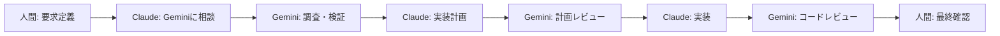

# 🔺 三位一体開発フレームワーク

## 概要

このフレームワークは、**人間・Claude Code・Gemini CLI**の3つの主体が、それぞれの強みを活かして協調的に開発を進める手法です。

単独のAIツールでは陥りがちな「沼」を回避し、トークン消費を抑えながら、高品質な成果物を効率的に生み出すことを目的としています。

## なぜ三位一体なのか？

### 各ツールの限界

**Claude Code**

- 計画力・実装力に優れる反面、意志があまりにない
- 「それは違うのでは？」に対して深く考えないで即答しがち
- 1回沼にハマると永遠にハマり続ける

**Gemini CLI**

- 俯瞰して情報を整理する力はあるが、実装力は低い
- 質問しただけなのに勝手にコードいじり始める

**人間**

- ビジョンと創造性はあるが、細かい実装は面倒
- 長時間の単純作業は苦手

### 三位一体による解決

|問題          |解決方法          |
|------------|--------------|
|Claudeの思い込み |Geminiによる客観的検証|
|Geminiの実装力不足|Claudeによる正確な実装|
|人間の実装負担     |AI同士の協調による自動化 |
|トークン枯渇      |調査をGeminiに分散  |

## フレームワークの実装

### 1. 必須ファイル

```
triforce-dev/
├── CLAUDE.md           # Claudeの行動規範（必須）
├── GEMINI.md          # Geminiの行動規範（必須）
├── PROJECT_SETUP.md   # セットアップガイド
└── .claude/
    └── commands/      # カスタムコマンド
```

### 2. 基本的な開発フロー



### 3. 実際の使用例

```bash
# 人間がClaudeに指示
> ユーザー認証機能を実装してください

# Claudeが自動的にGeminiに相談
$ gemini -p "Next.js 14でのユーザー認証実装のベストプラクティスは？"

# Geminiの回答を基にClaudeが計画
> 以下の計画で実装します：
> 1. NextAuthを使用
> 2. JWTトークンベース
> ...

# 実装後、Claudeが再度Geminiでレビュー
$ gemini -p "このコードのセキュリティ問題を指摘してください: [コード]"
```

## 導入効果

- Claude usage limit reached を全然見なくなった
- Claudeが沼にはまって抜け出せなくなる頻度が減った
- 意思決定の質が向上（多角的な視点）
- 実装速度の向上（役割分担の明確化）

## カスタマイズ

### プロジェクト特有の設定

1. **CLAUDE.md**の`プロジェクト情報`セクションを更新
1. **GEMINI.md**の`プロジェクト固有の文脈`を追加
1. 必要に応じてカスタムコマンドを作成

### 高度な使い方

**カスタムツールの追加**

- 発見スクリプトと実行スクリプトを作成
- settings.jsonで登録
- プロジェクト専用のツールとして活用

**思考モードの活用**

- “think” < “think hard” < “think harder” < “ultrathink”
- 複雑な問題ほど高レベルの思考モードを使用

## トラブルシューティング

### よくある問題

1. **Claudeが同じエラーを繰り返す**
- `/project:stuck-helper`コマンドを使用
- 手動で`gemini -p`で別視点を取得
1. **Geminiが実装しようとする**
- GEMINI.mdの設定を確認
- settingsでeditツールを無効化
1. **コンテキストオーバーフロー**
- 定期的に`/compact`を実行
- 大きなタスクは分割

## 今後の展望

この方法は、Gemini以外にも簡単に拡張可能です。例えば：

- **Cursor**：コード補完特化
- **GitHub Copilot**：ペアプログラミング
- **Perplexity**：深い調査タスク

四位一体、五位一体への拡張も可能です。

## 参考資料

- [元記事（Zenn）](https://zenn.dev/tksfjt1024/articles/5e88385bfb69fd)
- [Claude Code公式ドキュメント](https://docs.anthropic.com/claude-code)
- [Gemini CLI GitHub](https://github.com/google-gemini/gemini-cli)
- Claude Code Best Practices

-----

**Remember**: AIツールは道具です。最終的な価値判断と責任は常に人間にあります。三位一体は、その判断をより良いものにするためのフレームワークです。

# Dev ContainerでClaude Code & Gemini CLIセットアップガイド

## 必要なファイル構成

```
プロジェクトフォルダ/
├── .devcontainer/
│   ├── devcontainer.json
│   └── Dockerfile (オプション)
└── その他のプロジェクトファイル
```

## 1. devcontainer.json の作成

`.devcontainer/devcontainer.json` ファイルを作成し、以下の内容を記述します：

```json
{
  "name": "Claude Code & Gemini CLI Dev Container",

  // Node.js 20のイメージを使用
  "image": "mcr.microsoft.com/devcontainers/javascript-node:1-20-bookworm",

  // コンテナ作成後に実行するコマンド
  "postCreateCommand": "npm install -g @anthropic-ai/claude-code @google/gemini-cli",

  // VS Code設定
  "customizations": {
    "vscode": {
      "settings": {
        "terminal.integrated.defaultProfile.linux": "bash"
      },
      "extensions": [
        // 必要に応じてVS Code拡張機能を追加
        "dbaeumer.vscode-eslint",
        "esbenp.prettier-vscode"
      ]
    }
  },

  // 環境変数の設定（必要に応じて）
  "remoteEnv": {
    // Claude Code用の環境変数（必要な場合）
    // "ANTHROPIC_API_KEY": "${localEnv:ANTHROPIC_API_KEY}",

    // Gemini CLI用の環境変数（必要な場合）
    // "GEMINI_API_KEY": "${localEnv:GEMINI_API_KEY}"
  },

  // ユーザー設定
  "remoteUser": "node",

  // 必要に応じてポートフォワーディング
  // "forwardPorts": [3000],

  // 追加のFeatures（必要に応じて）
  "features": {
    "ghcr.io/devcontainers/features/git:1": {},
    "ghcr.io/devcontainers/features/github-cli:1": {}
  }
}
```

## 2. カスタムDockerfileを使用する場合（オプション）

より細かい制御が必要な場合は、`.devcontainer/Dockerfile` を作成：

```dockerfile
FROM mcr.microsoft.com/devcontainers/javascript-node:1-20-bookworm

# 追加の依存関係をインストール
RUN apt-get update && apt-get install -y \
    build-essential \
    python3 \
    && rm -rf /var/lib/apt/lists/*

# グローバルnpmパッケージのインストールは
# postCreateCommandで行うため、ここでは行わない
```

Dockerfileを使用する場合は、`devcontainer.json` を以下のように修正：

```json
{
  "name": "Claude Code & Gemini CLI Dev Container",

  // imageの代わりにDockerfileを指定
  "build": {
    "dockerfile": "Dockerfile"
  },

  // 以下は同じ
  "postCreateCommand": "npm install -g @anthropic-ai/claude-code @google/gemini-cli",
  // ...
}
```

## 3. 使用方法

1. **VS Codeで開く**
   - VS CodeでプロジェクトフォルダーShellを開く
   - コマンドパレット（Cmd/Ctrl+Shift+P）で「Dev Containers: Reopen in Container」を選択

2. **初回起動時**
   - コンテナのビルドが開始される
   - postCreateCommandが実行され、両CLIツールがインストールされる

3. **CLIツールの使用**
   ```bash
   # Claude Codeの起動
   claude

   # Gemini CLIの起動
   gemini
   ```

## 4. 認証設定

### Claude Code
初回実行時にOAuth認証が必要です：
```bash
claude
# ブラウザが開き、Anthropicアカウントでの認証を求められます
```

### Gemini CLI
初回実行時に認証方法を選択：
```bash
gemini
# "Login with Google" を選択（無料枠: 60リクエスト/分、1000リクエスト/日）
# またはAPIキーを使用
```

## 5. トラブルシューティング

### npmパッケージのインストールに失敗する場合
```json
// postCreateCommandを以下のように修正
"postCreateCommand": "sudo npm install -g @anthropic-ai/claude-code @google/gemini-cli"
```

### Node.jsバージョンが古い場合
両ツールともNode.js 18以上が必要です。imageを新しいバージョンに変更：
```json
"image": "mcr.microsoft.com/devcontainers/javascript-node:1-22-bookworm"
```

### 環境変数でAPIキーを設定する場合
```json
"remoteEnv": {
  "ANTHROPIC_API_KEY": "${localEnv:ANTHROPIC_API_KEY}",
  "GEMINI_API_KEY": "${localEnv:GEMINI_API_KEY}"
}
```
ローカルマシンで環境変数を設定しておく必要があります。

## 6. 複数プロジェクトでの再利用

この設定を複数のプロジェクトで使用する場合は、GitHub等でテンプレートリポジトリとして管理することをお勧めします。

## 参考リンク

- [Claude Code ドキュメント](https://docs.anthropic.com/en/docs/claude-code/overview)
- [Gemini CLI GitHub](https://github.com/google-gemini/gemini-cli)
- [Dev Containers仕様](https://containers.dev/)